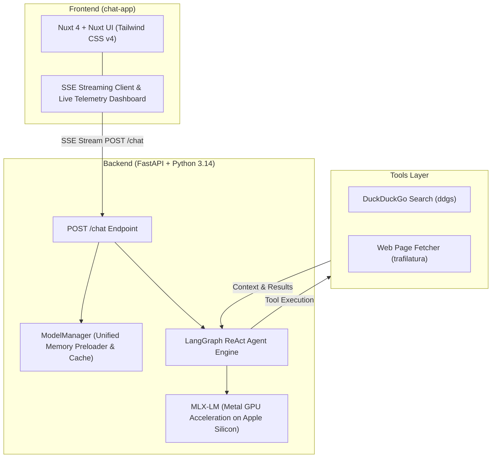

# AGENTS.md — Lean Architecture & Operational Spec for Local LLM

This document is the authoritative **Lean Specification** for AI agents (and engineers) modifying or extending the `local-llm` codebase.

---

## 1. System Architecture & Tech Stack



---

## 2. Core Architectural Invariants (DO NOT BREAK)

### A. Model Memory Lifecycle (`routers/chat.py` & `main.py`)
1. **Preloading**: All supported models in `SUPPORTED_MODELS` must be preloaded into memory at application startup in `ModelManager.preload_all_models()`.
2. **Instant Activation**: Switching between preloaded models (`ModelManager.activate_model()`) MUST be an in-memory pointer swap with **0.0s reload delay**.
3. **Shutdown Memory Flush**: On `KeyboardInterrupt` / FastAPI lifespan shutdown, `ModelManager.unload_all()` MUST clear all model references, run `gc.collect()`, and execute `mx.clear_cache()`.

### B. Streaming Protocol & Event Schema
The backend streams Server-Sent Events (`data: <JSON>\n\n`) with the following strict event types:
- `{"type": "thinking", "token": "..."}`: Internal reasoning tokens inside `<think>...</think>`.
- `{"type": "tool_call", "tool_name": "...", "tool_call_id": "...", "args": {...}}`: Intercepted tool call.
- `{"type": "tool_result", "tool_name": "...", "tool_call_id": "...", "result": [...]}`: Result payload from tool execution.
- `{"type": "answer", "token": "..."}`: Final markdown response tokens.
- `{"type": "metrics", "metrics": {...}}`: Hardware & generation telemetry payload.
- `data: [DONE]`: Stream completion indicator.

### C. Strict Thinking & Tool Tag Isolation (`agent/graph.py`)
- **Thinking Boundary**: Tokens generated before `</think>` MUST route **exclusively** to `thinking` events and NEVER leak to `answer`.
- **Tool Interception**: XML tags (`<tool_call>`, `<function=...>`, `<parameter=...>`) must be intercepted and swallowed in the post-thinking buffer.
- **Deterministic Synthesis**: After tool calls finish, the agent MUST trigger a synthesis pass with an explicit directive to force complete markdown generation without infinite search loops.

---

## 3. Directory Map & Responsibilities

| Path | Purpose |
| :--- | :--- |
| `main.py` | FastAPI application entrypoint, CORS setup, and lifespan lifecycle. |
| `routers/chat.py` | `/chat` endpoint, Pydantic schemas, and `ModelManager` memory cache. |
| `agent/graph.py` | LangGraph ReAct agent, tool parsing regex, and streaming state machine. |
| `agent/state.py` | TypedDict state definitions for LangGraph nodes. |
| `tools/web_search.py` | DuckDuckGo search (`perform_web_search`) and Trafilatura fetcher (`perform_web_fetch`). |
| `chat-app/` | Nuxt 4 frontend application. |
| `chat-app/shared/utils/models.ts` | Available model metadata and dropdown definitions. |
| `chat-app/app/pages/chat/[id].vue`| Main chat interface and SSE streaming event handler. |

---

## 4. Development & Verification Rules

### Package Management Rules
- **Backend**: Always use `uv` (e.g. `uv sync`, `uv run main.py`, `uv pip install ...`).
- **Frontend**: Always use `bun` (e.g. `bun install`, `bun dev`, `bun run lint`). Never use `npm` or `yarn`.

### Adding a New Model
1. Add model Hugging Face ID to `SUPPORTED_MODELS` in `routers/chat.py`.
2. Add model entry (label, value, icon) to `chat-app/shared/utils/models.ts`.
3. Verify memory footprint fits within Apple Silicon Unified Memory.

### Adding a New Tool
1. Define the tool schema in `tools/` using OpenAI/Qwen compatible JSON schema.
2. Implement the Python execution function.
3. Wire the tool definition and execution branch into `tools_node` and `stream_graph_chat` in `agent/graph.py`.

### Verification Checklist Before Commits
```bash
# 1. Backend Verification
uv run python -c "from routers.chat import ModelManager; print('Backend OK')"

# 2. Frontend Lint & Typecheck
cd chat-app
bun run lint
bun run typecheck
```
