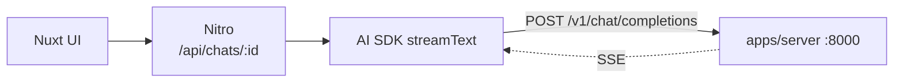

# ssm-mistral-mamba-chatbot

Coding chatbot on a **state space model**, not a transformer. Mamba-Codestral
7B → MLX → Apple Silicon, behind an OpenAI-compatible API, Nuxt frontend.

Portfolio project: judgment over feature count. Prefer small, well-reasoned
changes. Directory is still `local-llm`; the project is not — use the new name
in docs, package names, prose.

## Why SSM

Constant per-token cost, no growing KV cache; transformer attention grows with
context. That trade-off is the experiment — latency, memory, and long-context
comparisons are on-theme. Checkpoint is code-tuned, so coding is the domain.

## Map

| Path            | What                                       | Doc                     |
| --------------- | ------------------------------------------ | ----------------------- |
| `apps/server/` | MLX inference + OpenAI-compatible API      | `apps/server/CLAUDE.md` |
| `apps/web/`    | Nuxt 4 chat UI, NuxtHub + Drizzle + AI SDK | `apps/web/CLAUDE.md`    |
| `packages/`    | Shared Python members. Empty; benchmarks land here | —               |
| `docs/adr/`    | Why the architecture is what it is                 | `docs/adr/README.md` |

Read the nested doc for whichever half you're in — invariants live there.



**Not connected yet.** `apps/web` is the upstream template, still calling
hosted models via the Vercel AI Gateway. Wiring it is the central open task —
steps in `apps/web/CLAUDE.md`.

## Commands

Two package managers, one Makefile. Bare `make` lists targets.

```shell
make setup      # uv sync + bun install + git hooks
make dev        # inference server :8000
make web        # Nuxt :3000
make check      # lint both halves + typecheck
```

Hooks are lefthook (`lefthook.yml`). Pre-commit formats and lints staged files
(~0.1 s); pre-push runs the lockfile check, full lint, tests, and typecheck
(~7 s). `--no-verify` skips them; CI does not.

Python is a **uv workspace**: one `.venv` at the repo root, members installed
editable, `uv.lock` committed. There is no per-package venv and no
`requirements.txt`.

```shell
uv run llm-server                 # works from any directory in the repo
uv run llm-repl                   # streaming REPL against a running server
uv add --package llm-server X     # never hand-edit dependencies
uv sync --frozen                  # what CI runs; fails on a stale lock
```

`apps/web` keeps its own bun lockfile — one JS app doesn't justify a workspace.
Add bun workspaces when it gains a sibling.

## Rules

- Comments say **why**, not what. Match the existing density.
- Match surrounding style over outside habits.
- Never commit secrets. `.env` ignored, `.env.example` documents keys.
- Don't commit or push unless asked.
- Bad output → suspect prompt format and stop tokens before the model. One such
  bug already found (`apps/server/CLAUDE.md`).
- Verify against a running system, don't assert. `create_app(engine=FakeEngine())`
  skips the 3.8 GB load for anything not about generation quality.
- Architectural *why* goes in `docs/adr/`, not in a CLAUDE.md. These files say
  what the rules are; ADRs say what was rejected to arrive at them. A decision
  that changes gets a new record, never an edit.
