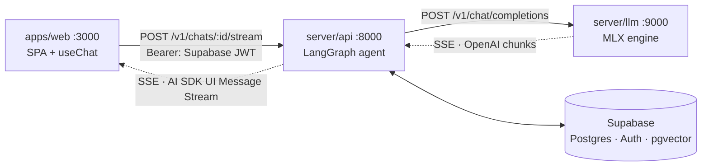

# ssm-mistral-mamba-chatbot

Coding chatbot on a **state space model**, not a transformer. Mamba-Codestral
7B → MLX → Apple Silicon, behind an OpenAI-compatible API, Nuxt frontend.

Portfolio project: judgment over feature count. Prefer small, well-reasoned
changes. Directory is still `local-llm`; the project is not — use the new name
in docs, package names, prose.

## Why SSM

Constant per-token cost, no growing KV cache; transformer attention grows with
context. That trade-off is the experiment — latency, memory, and long-context
comparisons are on-theme. Checkpoint is code-tuned, so coding is the domain.

## Map

Three processes, one per column of the diagram below.

| Path          | What                                                     | Doc                    |
| ------------- | -------------------------------------------------------- | ---------------------- |
| `server/llm/` | MLX inference + OpenAI-compatible API, `:9000`            | `server/llm/CLAUDE.md` |
| `server/api/` | BFF gateway: LangGraph agent, Supabase, auth, `:8000`     | `server/api/CLAUDE.md` |
| `apps/web/`   | Nuxt 4 chat UI (SPA, no Nitro backend), `:3000`           | `apps/web/CLAUDE.md`   |
| `packages/`   | Shared Python members. Empty; benchmarks land here        | —                      |
| `supabase/`   | SQL migrations. Postgres + Auth + Storage + pgvector      | —                      |
| `docs/adr/`   | Why the architecture is what it is                        | `docs/adr/README.md`   |

Read the nested doc for whichever process you're in — invariants live there.



**Two streaming protocols, one hop apart.** The gateway is an OpenAI client
upstream and an AI SDK server downstream; they share nothing but the letters
SSE. Getting that seam wrong renders a blank reply with no error anywhere —
[ADR 0006](docs/adr/0006-move-the-bff-into-a-python-gateway.md).

## Commands

Two package managers, one Makefile. Bare `make` lists targets.

```shell
make setup      # uv sync + bun install + git hooks
make llm        # MLX inference engine :9000   ← start first, it loads 3.8 GB
make api        # BFF gateway :8000
make web        # Nuxt :3000
make check      # lint both halves + typecheck
```

All three must run for chat to work. `make dev` is `make api` under
`APP_ENV=development`; `dev-stg` and `dev-prod` switch the env file.

Hooks are lefthook (`lefthook.yml`). Pre-commit formats and lints staged files
(~0.1 s); pre-push runs the lockfile check, full lint, tests, and typecheck
(~7 s). `--no-verify` skips them; CI does not.

Python is a **uv workspace**: one `.venv` at the repo root, members installed
editable, `uv.lock` committed. There is no per-package venv and no
`requirements.txt`.

```shell
uv run llm-engine                 # works from any directory in the repo
uv run api-server
uv add --package llm-engine X     # or --package api-server; never hand-edit
uv sync --frozen                  # what CI runs; fails on a stale lock
```

Distributions are `llm-engine` (`server/llm`) and `api-server` (`server/api`);
their import packages are `llm_engine` and `app`.

`apps/web` keeps its own bun lockfile — one JS app doesn't justify a workspace.
Add bun workspaces when it gains a sibling.

## Rules

- Comments say **why**, not what. Match the existing density.
- Match surrounding style over outside habits.
- Never commit secrets. `.env` ignored, `.env.example` documents keys.
- Don't commit or push unless asked.
- Bad output → suspect prompt format and stop tokens before the model. One such
  bug already found (`server/llm/CLAUDE.md`).
- **No output** → suspect the wire format before the model. Curl the gateway
  and read the frames; a protocol mismatch fails silently at the browser, which
  logs nothing (`server/api/CLAUDE.md`).
- Verify against a running system, don't assert. `create_app(engine=FakeEngine())`
  skips the 3.8 GB load for anything not about generation quality.
- Architectural *why* goes in `docs/adr/`, not in a CLAUDE.md. These files say
  what the rules are; ADRs say what was rejected to arrive at them. A decision
  that changes gets a new record, never an edit.
