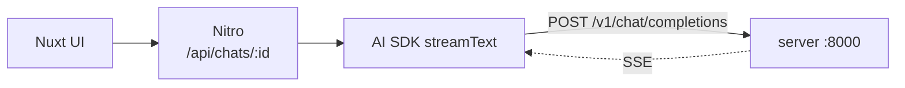

# ssm-mistral-mamba-chatbot

Coding chatbot on a **state space model**, not a transformer. Mamba-Codestral
7B → MLX → Apple Silicon, behind an OpenAI-compatible API, Nuxt frontend.

Portfolio project: judgment over feature count. Prefer small, well-reasoned
changes. Directory is still `local-llm`; the project is not — use the new name
in docs, package names, prose.

## Why SSM

Constant per-token cost, no growing KV cache; transformer attention grows with
context. That trade-off is the experiment — latency, memory, and long-context
comparisons are on-theme. Checkpoint is code-tuned, so coding is the domain.

## Map

| Path          | What                                       | Doc                    |
| ------------- | ------------------------------------------ | ---------------------- |
| `server/`   | MLX inference + OpenAI-compatible API      | `server/CLAUDE.md`   |
| `apps/web/` | Nuxt 4 chat UI, NuxtHub + Drizzle + AI SDK | `apps/web/CLAUDE.md` |

Read the nested doc for whichever half you're in — invariants live there.



**Not connected yet.** `apps/web` is the upstream template, still calling
hosted models via the Vercel AI Gateway. Wiring it is the central open task —
steps in `apps/web/CLAUDE.md`.

## Commands

No root workspace; run inside the package.

```shell
# server/ — venv interpreter always, never global python
.venv/bin/python main.py      # :8000
.venv/bin/python test.py      # streaming REPL

# apps/web/
bun run dev                   # :3000
bun run lint && bun run typecheck
```

## Rules

- Comments say **why**, not what. Match the existing density.
- Match surrounding style over outside habits.
- Never commit secrets. `.env` ignored, `.env.example` documents keys.
- Don't commit or push unless asked.
- Bad output → suspect prompt format and stop tokens before the model. One such
  bug already found (`server/CLAUDE.md`).
- Verify against a running system, don't assert. `create_app(engine=FakeEngine())`
  skips the 3.8 GB load for anything not about generation quality.
