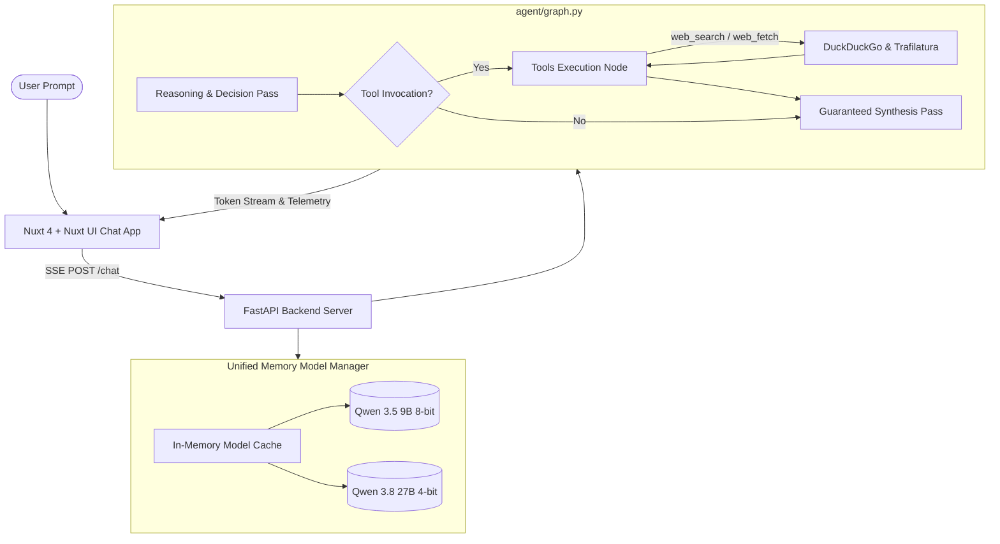

<a id="readme-top"></a>

<div align="center">
  <h1>Local LLM & Web Search Agent</h1>
  <p><strong>High-Performance Apple Silicon Local AI Assistant powered by MLX, LangGraph, FastAPI, and Nuxt 4</strong></p>

  [](https://python.org)
  [](https://github.com/ml-explore/mlx)
  [](https://fastapi.tiangolo.com)
  [](https://langchain-ai.github.io/langgraph/)
  [](https://nuxt.com)
  [](https://tailwindcss.com)
</div>

---

## Overview

**Local LLM** is a full-stack, local AI assistant engineered for Apple Silicon Macs. It combines native **MLX GPU acceleration** with a **LangGraph ReAct agent loop**, live **DuckDuckGo web search and page fetching**, and a modern **Nuxt 4 + Nuxt UI** conversational interface with real-time SSE streaming.

---

## Key Features

- **Native Apple Silicon Acceleration**: Powered by `mlx-lm` for low-latency unified memory inference on Apple M-series chips.
- **Multi-Model Memory Preloading**:
  - **Qwen 3.5 9B (8-bit)**: Fast responsiveness (~45-50 tokens/sec).
  - **Qwen 3.8 27B (4-bit)**: Deep reasoning and complex coding (~7.7 tokens/sec at peak memory bandwidth).
  - Models are preloaded into Unified Memory on startup for instant (0.0s) model switching.
- **Dual Web Tools**:
  - `web_search`: Live DuckDuckGo web search with snippet aggregation.
  - `web_fetch`: Rich body text extraction via Trafilatura for full documentation pages and live data.
- **Deterministic Multi-Step ReAct Agent**:
  - Full support for parallel and sequential tool calling without tag leakage.
  - Guaranteed answer synthesis phase to prevent infinite search loops.
- **Reasoning Isolation & Thinking Budget**:
  - Thinking tokens are strictly isolated within collapsible thought accordions.
  - Zero thinking or tool tags bleed into the final markdown response.
- **Real-Time Telemetry & Metrics**:
  - Live hardware metrics: Generation speed (`tok/s`), Prompt prefill speed, Peak RAM usage, and elapsed execution time.
- **Modern Nuxt UI Interface**:
  - Dark and light themes, source cards with collapsible previews, markdown rendering with syntax highlighting, and responsive layout.

---

## Architecture



---

## Repository Structure

```text
local-llm/
├── agent/
│   ├── graph.py             # LangGraph ReAct agent & multi-step streaming state machine
│   └── state.py             # Agent state definitions
├── tools/
│   └── web_search.py        # DuckDuckGo search + Trafilatura webpage fetcher
├── routers/
│   └── chat.py              # FastAPI chat endpoint & in-memory ModelManager
├── main.py                  # Server entrypoint with lifespan startup/shutdown lifecycle
├── pyproject.toml           # Python dependencies (managed via uv)
├── chat-app/                # Nuxt 4 Frontend
│   ├── app/
│   │   ├── pages/           # Chat UI routes
│   │   ├── components/      # Chat, tools, and telemetry components
│   │   └── composables/     # SSE streaming & model state hooks
│   ├── shared/utils/        # Model definitions and helpers
│   └── package.json         # Node dependencies (managed via bun)
└── README.md
```

---

## Getting Started

### Prerequisites

- macOS with Apple Silicon (M1/M2/M3/M4/M5 recommended, 16GB+ RAM).
- [uv](https://github.com/astral-sh/uv) for fast Python package management.
- [bun](https://bun.sh) for frontend package management.

---

### 1. Backend Setup

```bash
# Clone the repository
git clone https://github.com/terryong31/local-llm.git
cd local-llm

# Create virtual environment and install dependencies with uv
uv sync

# Configure environment variables
cp .env.example .env
# Edit .env and add your HF_TOKEN for high-speed Hugging Face downloads

# Start the local LLM backend server
uv run main.py
```

The backend server will start on `http://localhost:8000`.

---

### 2. Frontend Setup

```bash
# Navigate to the chat frontend
cd chat-app

# Install frontend dependencies with bun
bun install

# Run the development server
bun dev
```

Open `http://localhost:3000` in your browser.

---

## Configuration (`.env`)

```env
# Optional: Hugging Face Token for fast model downloads
HF_TOKEN=hf_your_token_here

# Optional: Enable live reloading for backend development
RELOAD=false
```

---

## Model Performance on Apple Silicon

| Model | Quantization | RAM Usage | Generation Speed (M5) |
| :--- | :--- | :--- | :--- |
| **Qwen 3.5 9B** | 8-bit | ~9.5 GB | **~45-50 tok/s** |
| **Qwen 3.8 27B** | 4-bit | ~15.0 GB | **~7.5-8.0 tok/s** |

---

## Contributing

Contributions are welcome! Please check out [CONTRIBUTING.md](CONTRIBUTING.md) for details on our code style, development workflow, and pull request guidelines.

---

## License

Distributed under the MIT License. See `LICENSE` for more information.

<p align="right">(<a href="#readme-top">back to top</a>)</p>