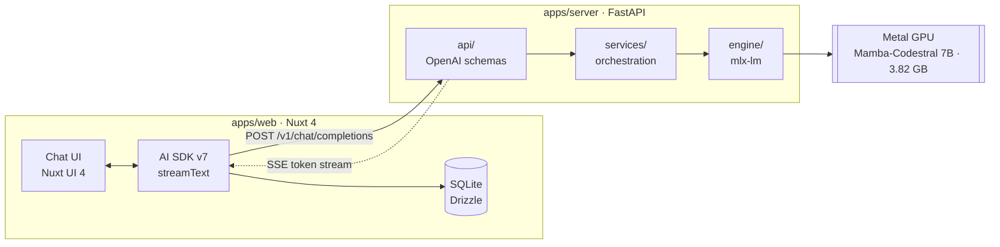

<div align="center">

# ssm-mistral-mamba-chatbot

**A coding assistant powered by a state space model instead of a transformer.**

Mistral's Mamba-Codestral 7B, running locally on Apple Silicon via MLX, served
behind an OpenAI-compatible API with a Nuxt chat frontend.

<sub>

[MLX](https://github.com/ml-explore/mlx) ·
[FastAPI](https://fastapi.tiangolo.com/) ·
[Nuxt 4](https://nuxt.com/) ·
[Nuxt UI](https://ui.nuxt.com/) ·
[Vercel AI SDK](https://sdk.vercel.ai/)

</sub>

</div>

## Table of contents

- [About](#about)
- [Architecture](#architecture)
- [Features](#features)
- [Prerequisites](#prerequisites)
- [Installation](#installation)
- [Usage](#usage)
- [Configuration](#configuration)
- [Project structure](#project-structure)
- [Deployment](#deployment)
- [Known limitations](#known-limitations)
- [Roadmap](#roadmap)
- [License](#license)
- [Acknowledgements](#acknowledgements)

## About

Nearly every chatbot you have used is a transformer. This one is not.

**Mamba** is a state space model: it carries a fixed-size recurrent state
instead of attending over the whole context, so per-token inference cost stays
constant and there is no KV cache growing with conversation length. A
transformer's attention cost grows with context. This project exists to build
something real on that architecture and find out where the trade-off helps and
where it hurts.

The checkpoint is
[Mamba-Codestral-7B](https://huggingface.co/mistralai/Mamba-Codestral-7B-v0.1),
Mistral's code-tuned Mamba model, 4-bit quantized for MLX — so the target
domain is programming assistance.

Everything runs on your own machine. No inference leaves the device.

> **Status:** the inference server is complete and tested. The frontend is the
> Nuxt UI chat template and still calls hosted models; wiring it to the local
> server is in progress. See [Roadmap](#roadmap).

## Architecture



The server implements the OpenAI chat-completions protocol deliberately: any
OpenAI client works against it by changing one base URL, and the model can be
swapped for a hosted one without touching the frontend.

Internally the server is layered `api → services → engine`, where `engine`
depends on no web framework and `api` depends on no inference library. Pointing
it at vLLM, Ollama, or a remote endpoint means writing one class against the
`LLMEngine` protocol.

## Features

- **OpenAI-compatible API** — `/v1/chat/completions`, `/v1/models`, streaming
  and buffered, with OpenAI's error envelope.
- **Real SSE streaming** with backpressure, so a slow client throttles
  generation rather than growing an unbounded buffer.
- **Client-disconnect cancellation** — closing the tab stops the GPU work.
- **Admission control** — generation is serialized (MLX is not thread-safe);
  excess load is shed with `503` + `Retry-After` instead of queueing forever.
- **Liveness/readiness split**, so a slow model load is never mistaken for a
  dead process.
- **Optional bearer auth**, off by default for localhost, enabled by config.
- **Request-scoped logging**, so concurrent generations stay legible.
- **Multimodal-ready message schema** — image parts are modelled end to end and
  rejected with a clear 400 by text-only engines.

## Prerequisites

- **Apple Silicon Mac.** MLX targets Metal; there is no CUDA or CPU fallback.
- **~8 GB free RAM** — the 4-bit checkpoint is 3.82 GB resident.
- **~4 GB disk** for the Hugging Face cache.
- [uv](https://docs.astral.sh/uv/) for the Python half and
  [Bun](https://bun.sh/) for the frontend. uv installs the pinned Python
  (3.14) itself — no system Python needed.

## Installation

```shell
git clone <your-repo-url> ssm-mistral-mamba-chatbot
cd ssm-mistral-mamba-chatbot
make setup
```

`make setup` runs `uv sync` and `bun install`. The Python side is a uv
workspace: one `.venv` at the repo root shared by every member, resolved from
the committed `uv.lock`.

The frontend also needs an env file:

```shell
cp apps/web/.env.example apps/web/.env    # NUXT_SESSION_PASSWORD must be ≥32 chars
```

## Usage

Start the server. The first run downloads the checkpoint (~3.8 GB); later
starts take a few seconds.

```shell
make dev          # or: uv run llm-server
```

Talk to it from the terminal:

```shell
make repl         # or: uv run llm-repl
```

Or directly over HTTP:

```shell
curl -N http://127.0.0.1:8000/v1/chat/completions \
  -H 'content-type: application/json' \
  -d '{
        "messages": [{"role": "user", "content": "Write a Python LRU cache."}],
        "stream": true
      }'
```

Or with any OpenAI client:

```python
from openai import OpenAI

client = OpenAI(base_url="http://127.0.0.1:8000/v1", api_key="not-needed")
stream = client.chat.completions.create(
    model="mamba-codestral",
    messages=[{"role": "user", "content": "Explain state space models."}],
    stream=True,
)
for chunk in stream:
    print(chunk.choices[0].delta.content or "", end="", flush=True)
```

Run the frontend in a second terminal:

```shell
make web          # http://localhost:3000
```

### Endpoints

| Method | Path | Description |
| --- | --- | --- |
| `POST` | `/v1/chat/completions` | Chat, buffered or SSE (`"stream": true`) |
| `GET` | `/v1/models` | Lists the loaded checkpoint |
| `GET` | `/healthz` | Liveness — is the process up |
| `GET` | `/readyz` | Readiness — 503 until weights are resident |

## Configuration

Server settings are `LLM_`-prefixed environment variables or lines in
`apps/server/.env`. Defaults live in
[`apps/server/llm_server/config.py`](apps/server/llm_server/config.py).

| Variable | Default | Description |
| --- | --- | --- |
| `LLM_MODEL_ID` | `mlx-community/Mamba-Codestral-7B-v0.1-4bit` | Any MLX checkpoint |
| `LLM_HOST` / `LLM_PORT` | `127.0.0.1` / `8000` | Bind address |
| `LLM_API_KEYS` | `[]` | JSON list; empty disables auth |
| `LLM_CORS_ORIGINS` | `["http://localhost:3000"]` | Allowed browser origins |
| `LLM_TEMPERATURE` | `0.7` | Sampling default; per-request override allowed |
| `LLM_MAX_TOKENS_LIMIT` | `2048` | Hard server-side ceiling |
| `LLM_MAX_QUEUE_DEPTH` | `8` | Waiting requests before shedding load |
| `LLM_EXTRA_EOS_TOKENS` | `[]` | Extra stop tokens for other checkpoints |

```shell
LLM_MODEL_ID=mlx-community/Qwen2.5-7B-Instruct-4bit LLM_PORT=9000 uv run llm-server
```

Frontend configuration lives in `apps/web/.env` — see `.env.example`.

## Project structure

```
pyproject.toml           uv workspace root — no package of its own
uv.lock                  Committed; one lock for every Python member
Makefile                 Single entrypoint across both package managers
apps/
  server/                Python inference API — distribution "llm-server"
    llm_server/
      __main__.py        Entrypoint behind the `llm-server` script
      asgi.py            Module-level app for import-string process managers
      repl.py            `llm-repl`, a worked SSE client
      config.py          Env-driven settings
      app.py             App factory: lifespan, middleware, error mapping
      errors.py          Domain errors, decoupled from HTTP
      observability.py   Request-id logging
      engine/            Model runtimes (base.py defines the protocol)
      services/          Orchestration; agent logic belongs here
      api/               Schemas, dependencies, routers
  web/                   Nuxt 4 chat frontend — bun, own lockfile
packages/                Future Python members (benchmarks)
```

## Deployment

Split, and neither half is Docker.

| Half | Where | How |
| --- | --- | --- |
| `apps/web` | Vercel | Nitro's `vercel` preset, no code changes — [ADR 0002](docs/adr/0002-host-the-frontend-on-vercel.md) |
| `apps/server` | Natively, on a Mac | `uv run llm-server`, reached over a tunnel — [ADR 0001](docs/adr/0001-run-the-server-natively.md) |

The reasoning and the rejected alternatives live in
[`docs/adr/`](docs/adr/README.md).

## Known limitations

- **Apple Silicon only.** MLX has no CUDA or CPU backend, and the server cannot
  be containerized — [ADR 0001](docs/adr/0001-run-the-server-natively.md).
- **One generation at a time.** Excess load is shed with `503`, not queued —
  [ADR 0003](docs/adr/0003-serialize-generation.md).
- **No tool calling.** Chat completions only.
- **Text only.** The schema models image parts; no vision engine exists yet.
- **This checkpoint ships a wrong stop token**, and the engine corrects it at
  load — [ADR 0004](docs/adr/0004-reconcile-eos-tokens.md).

## Roadmap

- [x] OpenAI-compatible streaming inference server
- [x] Admission control, cancellation, readiness probes
- [ ] Point the Nuxt frontend at the local server instead of hosted models
- [ ] Coding-focused system prompt in place of the template's generic persona
- [ ] Benchmark Mamba vs. a comparable transformer on latency, memory, and
      long-context behaviour — the experiment this project exists for
- [x] uv workspace, committed lockfile, CI on both halves
- [ ] Automated test suite for the server
- [ ] Deploy the frontend (Vercel) and expose the local server over a tunnel

## License

MIT — see [LICENSE](LICENSE).

> The current `LICENSE` still carries the Nuxt UI Templates copyright line
> inherited from the frontend template. Update the holder before publishing.

## Acknowledgements

- [Mistral AI](https://mistral.ai/) — Codestral Mamba
- [Albert Gu and Tri Dao](https://arxiv.org/abs/2312.00752) — the Mamba
  architecture
- [Apple MLX](https://github.com/ml-explore/mlx) and
  [`mlx-lm`](https://github.com/ml-explore/mlx-lm)
- [`mlx-community`](https://huggingface.co/mlx-community) — quantized weights
- [Nuxt UI chat template](https://github.com/nuxt-ui-templates/chat) — frontend
  starting point
