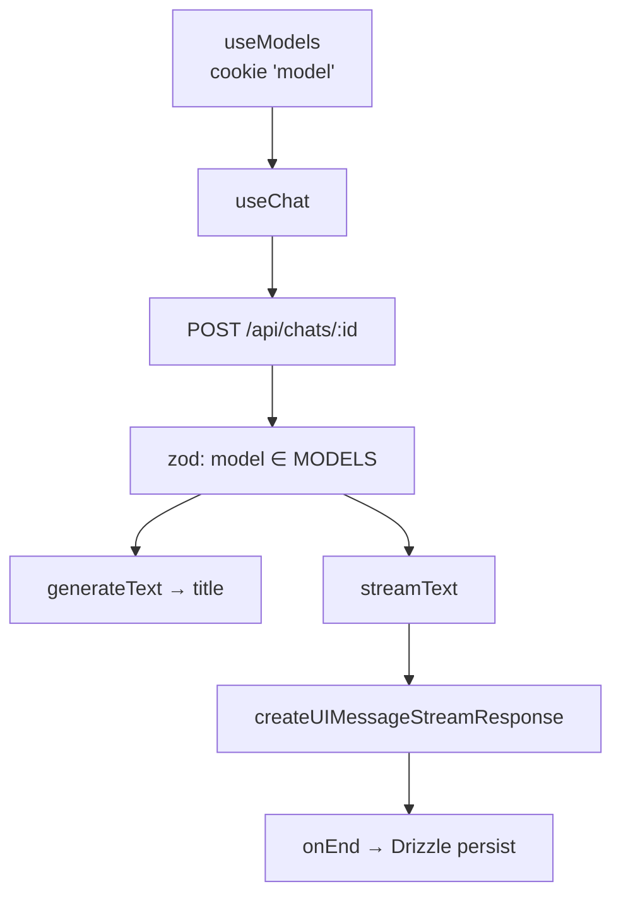

# apps/web — chat frontend

Nuxt 4 + Nuxt UI 4. Forked from [`nuxt-ui-templates/chat`](https://github.com/nuxt-ui-templates/chat);
most files still upstream's.

## Stack

| Concern        | Choice                                                          |
| -------------- | --------------------------------------------------------------- |
| Chat/streaming | Vercel AI SDK v7 (`ai`, `@ai-sdk/vue`)                      |
| Backend        | Nitro routes,`server/api/`                                    |
| DB             | NuxtHub`hub:db` → SQLite local / Turso prod, Drizzle         |
| Auth           | `nuxt-auth-utils`, GitHub OAuth                               |
| Other          | `nuxt-csurf` (global), `@comark/nuxt` + Shiki, NuxtHub blob |

## Commands

```shell
bun run dev          # :3000
bun run lint
bun run typecheck
bun run db:generate  # after editing server/db/schema.ts
bun run db:migrate
```

Needs `.env` (copy `.env.example`). `NUXT_SESSION_PASSWORD` ≥32 chars. Turso
creds not needed locally.

## Structure

```
app/pages/           index.vue, chat/[id].vue
app/components/chat/ message rendering, files, tools
app/composables/     useChats, useChatActions, useModels, useFileUpload
server/api/chats/[id].post.ts   ← the LLM call
server/db/schema.ts  users, chats, messages, votes
shared/utils/models.ts          MODELS registry
```

`shared/` auto-imports via `#shared`. Composables and components auto-import —
no manual imports.



## Open task: connect the local model

`streamText({ model: 'openai/gpt-5-nano' })` uses the bare-string form, which
resolves through the **Vercel AI Gateway** via `AI_GATEWAY_API_KEY`. Nothing
here talks to `server/` yet. Four changes:

1. `shared/utils/models.ts` — add e.g. `local/mamba-codestral`. The zod
   `refine` in the chat route validates against this list.
2. Provider instance — bare strings only reach the gateway. Use
   `createOpenAI({ baseURL })` from the installed `@ai-sdk/openai`, or add
   `@ai-sdk/openai-compatible` (**not a dependency yet**), the better fit.
3. `server/api/chats/[id].post.ts` — branch on the `local/` prefix.
4. **Drop `tools`, `stopWhen`, and `providerOptions` for the local model.** The
   server does chat completions only and ignores unknown fields silently, so
   leaving tools on yields a model asked to call them that never does.

Title generation hardcodes `'openai/gpt-5-nano'` (~line 49) — repoint it or
local-only setups still need a gateway key.

## Gotchas

- Chat route's system prompt is a generic assistant with "no markdown headings"
  rules — wrong persona for a coding chatbot on a code-tuned model.
- `.data/db/` is generated. Schema changes go `db:generate` → `db:migrate`.
- Chats scope to `session.user?.id || session.id` — anonymous users get history
  without login.
- `nitro.experimental.openAPI` on; routes carry `defineRouteMeta`. Keep adding.
