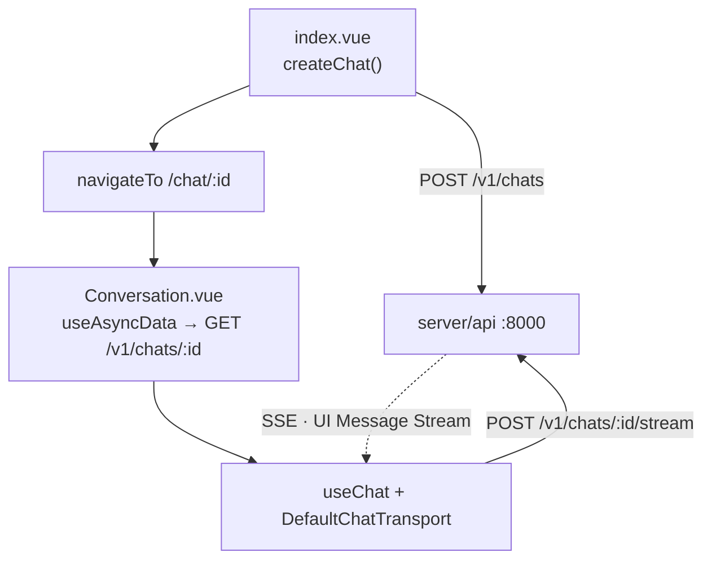

# apps/web — chat frontend

Nuxt 4 + Nuxt UI 4. Forked from [`nuxt-ui-templates/chat`](https://github.com/nuxt-ui-templates/chat);
much of the UI is still upstream's, but the backend it came with is gone.

**There is no `server/` directory.** Nitro builds and serves the SPA and
nothing else — no routes, no database, no session. Every request goes
cross-origin to `server/api` on `:8000` with a Supabase JWT
([ADR 0006](../../docs/adr/0006-move-the-bff-into-a-python-gateway.md)).

## Stack

| Concern        | Choice                                                                    |
| -------------- | ------------------------------------------------------------------------- |
| Rendering      | SPA, `ssr: false`; `/` prerendered ([ADR 0005](../../docs/adr/0005-render-the-frontend-client-side.md)) |
| Chat/streaming | Vercel AI SDK v7 (`ai`, `@ai-sdk/vue`), `DefaultChatTransport`             |
| Backend        | `server/api` over HTTP — `NUXT_PUBLIC_BACKEND_URL`                         |
| Data & auth    | `@nuxtjs/supabase`; the client reads, the gateway writes                   |
| Other          | `nuxt-csurf`, `@comark/nuxt` + Shiki, `nuxt-charts`                        |

## Commands

```shell
bun run dev          # :3000, loads .env.development
bun run dev:stg      # .env.staging          (also :prod)
bun run lint
bun run typecheck
```

Needs `.env.development` (copy `.env.example`): `SUPABASE_URL`,
`SUPABASE_KEY`, `NUXT_PUBLIC_BACKEND_URL`. Chat needs `server/api` **and**
`server/llm` running — `make api` and `make llm`.

## Structure

```
app/spa-loading-template.html   shell before Vue mounts; inline CSS only
app/pages/           index.vue, chat/[id].vue (thin <Suspense> wrapper)
app/components/chat/ Conversation.vue ← the chat page's real body
app/composables/     useSupabaseChats, useSupabaseMessages, useAuthToken,
                     useModels, useFileUpload
shared/utils/models.ts          MODELS registry (see gotcha below)
```

**No top-level `await` in a page.** There is no server render behind it, so an
awaited fetch holds the shell blank. Fetch lazily, or push the await into a
child behind `<Suspense>` — that is why `ChatConversation` exists.

`shared/` auto-imports via `#shared`. Composables and components auto-import —
no manual imports.



## Invariants

- **The first turn is sent by `onMounted`, not by the composer.** `index.vue`
  creates the chat with its first message and navigates away; `Conversation.vue`
  sees `messages.length === 1` and calls `regenerate()`. Break that and a new
  chat sits there with a user message and no reply.
- **Message ids come from the database.** `regenerate()` and `sendMessage()`
  re-POST the transcript, and the gateway upserts the user turn on the id it
  finds. Minting a fresh id client-side duplicates the row.
- **`useSupabaseMessages().saveMessage` is a no-op stub.** Persistence is
  entirely server-side. It is still called in `handleSubmit` and `onFinish`;
  those calls do nothing and must not be relied on.
- **Ownership is the gateway's answer, not the client's.** `isOwner` comes from
  the `GET /v1/chats/:id` payload. Recomputing it from `useSupabaseUser()` — as
  this file used to — reads as `false` whenever there is no session, which
  hides the composer and skips the first-turn auto-send, so a new chat sits
  there with a question and no reply.
- **The chat title arrives mid-stream**, as a transient `data-chat-title` part
  handled in `onData`. It is already persisted when it arrives; take
  `dataPart.data.title` directly rather than refetching to find out what it is.

## Gotchas

- **The picker's list comes from the server, not from `models.ts`.** `useModels`
  fetches `GET /v1/models` from the gateway, which proxies what the engine has
  loaded; `MODEL_LABELS` only prettifies ids it recognises, and an unknown id
  still renders. Do not reintroduce a hardcoded registry — the previous one
  advertised three hosted models that every request quietly answered with the
  local checkpoint.
- **The `model` cookie is reconciled on load.** A value not present in the
  fetched list is replaced with the first available id. Browsers still hold
  `anthropic/claude-haiku-4.5` from the template; without this they keep
  sending a dead string forever.
- **Message ids must be UUIDs.** `messages.id` is a `uuid` column and
  `votes.message_id` references it, but the AI SDK's default generator emits
  nanoid strings like `LUMdEkfm5WARUMBu`. `useChat` is configured with
  `generateId: () => crypto.randomUUID()` for exactly this reason; remove it
  and every turn after the first is rejected by Postgres and dropped from
  history, leaving the model to answer from a transcript with no user turns.
- **`nuxt-csurf` guards nothing that matters.** Chat is not a Nitro route any
  more; the gateway's bearer check is the real control.
- **`nitro.experimental.openAPI` is dead config** — it documents routes that no
  longer exist.
- **Sign-in is required.** `useAuthToken` reads the Supabase session; with no
  session the `Authorization` header is omitted, which only works because the
  gateway's development mode waves it through.
- Chat visibility is enforced by the gateway, not by RLS in the client.
